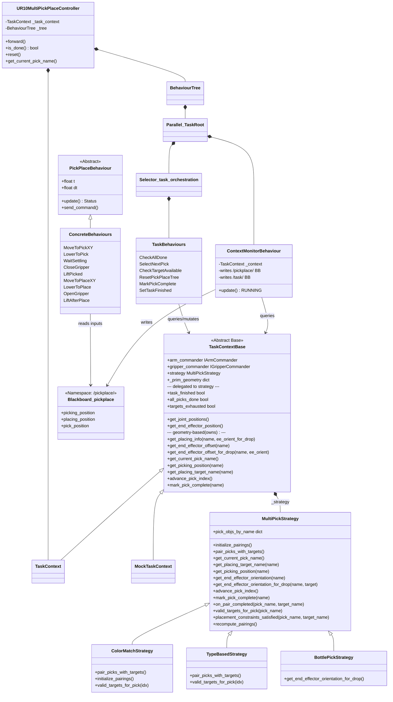

# Analysis of PickPlace Controller Interface

> **Note (pt-cortex branch):** This document has been updated to reflect the Cortex
> refactoring. Key changes:
> - Behaviours now send commands via `IArmCommander` / `IGripperCommander` instead of
>   computing `ArticulationAction` and writing to blackboard `current_action`.
> - `UR10MultiPickPlaceController.forward()` just ticks the tree — no post-tick
>   `apply_action()` call.
> - `TaskContext` provides `arm_commander` / `gripper_commander` properties.
> - Real simulation uses `CortexWorld` + `CortexUr10` with `MotionCommander`.

This document analyzes the interface and interaction between `UR10MultiPickPlaceController`, its `TaskContext`, and the underlying py_trees behaviour tree.

## Overview

The `UR10MultiPickPlaceController` is a task-level controller for the UR10 robot that orchestrates multi-object pick-and-place using a **py_trees Behaviour Tree**. The tree combines a `ContextMonitorBehaviour` (which refreshes blackboard data from a `TaskContext` each tick) with a task orchestration subtree that cycles through pick objects, executing a 9-phase pick-place sequence for each.

**Hierarchy:**

```
UR10MultiPickPlaceController (task_controllers/)
    ├── has-a TaskContext (task_context.py) — hardware facade + delegates to MultiPickStrategy
    └── wraps a py_trees.BehaviourTree
        └── Parallel("TaskRoot", SuccessOnOne)
              ├── ContextMonitorBehaviour — writes to /pickplace/ and /task/ blackboards
              └── Selector("task_orchestration")
                    ├── CheckAllDone
                    └── Sequence("finish_or_fail")
                          ├── FailureIsSuccess → Repeat → do_one_pick_place
                          │     ├── SelectNextPick
                          │     ├── CheckTargetAvailable
                          │     ├── ResetPickPlaceTree
                          │     ├── pick_then_place (9-phase Sequence)
                          │     │     ├── pick_item: MoveToPickXY → LowerToPick → WaitSettling → CloseGripper → LiftPicked
                          │     │     └── place_item: MoveToPlaceXY → LowerToPlace → OpenGripper → LiftAfterPlace
                          │     └── MarkPickComplete
                          └── SetTaskFinished
```

## Architecture

### 1. UR10MultiPickPlaceController

The top-level controller wraps the py_trees `BehaviourTree`. It no longer inherits from `BaseController` or manages state manually — all orchestration logic lives in the behaviour tree.

* **Responsibility**:
  * Builds and sets up the behaviour tree via `make_task_controller_tree()` (from `pt_task_tree.py`).
  * `forward()`: ticks the tree. Behaviours send commands directly to `arm_commander` / `gripper_commander`.
  * `is_done()`: queries `TaskContext` for task_finished / all_picks_done / targets_exhausted.
  * `reset()`: resets `TaskContext` and stops the tree (→ INVALID).

### 2. TaskContext / TaskContextBase

`TaskContextBase` (`task_context_base.py`) is the shared base class for `TaskContext` (real scene) and `MockTaskContext` (testing). It holds robot hardware refs, owns the `_prim_geometry` cache and geometry-based computations, and delegates pairing/iteration/EE-orientation calls to a `MultiPickStrategy`.

`TaskContext` (`task_context.py`) adds real-scene wiring (auto-detects `CortexUr10` and creates `CortexArmAdapter` / `CortexGripperAdapter`).

* **State Query Methods** (called by `ContextMonitorBehaviour`):
  * `get_joint_positions()`, `get_end_effector_position()` — hardware, on TaskContextBase
  * `get_current_pick_name()`, `get_picking_position(pick_name)` — delegated to strategy
  * `get_placing_target_name(pick_name)` → `Optional[str]` — delegated to strategy (pure pairing lookup)
  * `get_placing_info(pick_name, end_effector_orientation_for_drop=None)` → `(target_name, target_position, target_orientation)` — implemented on TaskContextBase using `_prim_geometry` for drop-Z computation
  * `get_end_effector_offset(pick_name)` — implemented on TaskContextBase using `_prim_geometry`, applies `_EE_OFFSET_FALLBACK` when no geometry available
  * `get_end_effector_orientation(pick_name)`, `get_end_effector_orientation_for_drop(pick_name, target_name)` — delegated to strategy for per-item/per-target customization
  * `get_end_effector_offset_for_drop(pick_name, end_effector_orientation_for_drop)` — implemented on TaskContextBase using `_prim_geometry`; returns the world-frame EE-to-item-center vector, computed as the pick offset (`[0, 0, grasp_height]`) rotated by `R_drop · R_pick⁻¹`. When the drop orientation matches the pick orientation the result equals the pick offset; for the bottle case (90° EE rotation) it becomes a horizontal `grasp_height` offset. Returns `None` when no drop orientation is supplied or no geometry is available, so the caller can fall back to the pick-side offset.
  * `get_ee_height_for_move()` — hardware/config, on TaskContextBase

* **Commander Properties** (Cortex-aligned, used by PickPlace behaviours):
  * `arm_commander` — `IArmCommander` for end-effector motion (CortexArmAdapter, MockArmCommander, or NullArmCommander in teleport mode)
  * `gripper_commander` — `IGripperCommander` for gripper control (CortexGripperAdapter, MockGripperCommander, or NullGripperCommander in teleport mode)

* **Mutation Methods** (called by task behaviours):
  * `advance_pick_index()` → next pick name or None (delegated to strategy)
  * `mark_pick_complete(pick_name)` — records completion, calls strategy's `on_pair_completed` hook (delegated to strategy)

* **Properties** (delegated to strategy): `task_finished`, `all_picks_done`, `targets_exhausted`, `picking_order_item_names`

* **Strategy access**: `context.strategy` returns the `MultiPickStrategy` instance.

* **MockTaskContext** (`task_context_mock.py`): test-friendly implementation. Creates a default `MultiPickStrategy` internally when none provided.

### 2b. MultiPickStrategy

`MultiPickStrategy` (`multi_pick_strategy.py`) owns all pick-to-target pairing logic, pick iteration, EE orientation decisions, completion tracking, and verification hooks.

* **Pairing computation** (overridable): `initialize_pairings()`, `pair_picks_with_targets()` → yields `(pick_idx, Optional[tgt_idx])` tuples
* **Pick iteration**: `get_current_pick_name()`, `advance_pick_index()`, `all_picks_done`, `picking_order_item_names`
* **Target/placing info**: `get_picking_position(name)`, `get_placing_target_name(name)` → `Optional[str]` (pure pairing lookup)
* **EE orientation**: `get_end_effector_orientation(pick_name)`, `get_end_effector_orientation_for_drop(pick_name, target_name)` — overridable per strategy subclass for per-item/per-target customization
* **Completion tracking**: `mark_pick_complete(pick_name)`, `on_pair_completed(pick_name, target_name: Optional[str])` (overridable hook)
* **Reordering/update**: `reorder_picks(new_order_names, current_pick_name=None)`, `update_pairings(pairings_by_pick_name)`, `recompute_pairings(preserve_current=True, respect_completed=True)`, `reset(picking_order_item_names=None)`
* **Verification hooks**: `valid_targets_for_pick(pick_name) -> List[str]`, `placement_constraints_satisfied(pick_name, target_name) -> (bool, str)`

**Strategy subclasses:**

| Strategy | Used by | Pairing logic |
| :--- | :--- | :--- |
| `MultiPickStrategy` (default) | TableTask3, TableTask4, TableTask5, etc. | Sequential: pick[i] → target[i] |
| `ColorMatchStrategy` | TableTaskColors1, TableTaskColorBinSort, TableTaskColorShapes | Match by semantic color label; filters picking order to matched-only |
| `TypeBasedStrategy` | TableTaskConveyorSort, TableTaskShapeSortBoxes, TableTaskConveyorTypeSort | Route picks to per-type target groups via `target_indices_by_type: Dict[str, List[int]]`; type resolved from explicit `source_types`, optional `type_detect_fn`, or default name-prefix match |
| `BottlePickStrategy` | TableTaskBottles1 | Sequential pairing; overrides drop orientation (pi/2 around X). Drop offset computed by TaskContextBase from `_prim_geometry` when EE orientation changes |

Tasks provide a `create_strategy` callable via `TaskSpec.implementation` (a nested `TaskImplementationSpec`) to return the appropriate strategy subclass.

### 2c. TaskSpec, TaskImplementationSpec, SimulationConfigurator, TaskController

Recent refactoring separated `UR10MultiPickPlaceTask` into three concerns, and further split `TaskSpec` into description side + execution-policy side:

* **`TaskSpec`** (`task_spec.py`) — Declarative dataclass for the SCENE/DESCRIPTION side: generation strategies, workspace setup (`setup_workspace`), conveyor configuration (`conveyor_speed`, `conveyor_falloff_*`), verification semantics (`spatial_check_fn`, `placement_constraints_fn`, `containment_check`, `box_verification_info`), scene fact `stacking_enabled`, and scene-side metadata (`scenario`, `pick_description`, `target_description`, `verification_description`, `rationale`). Tasks pass the full spec to `super().__init__(task_spec=spec, ...)`. Supports JSON serialization via `to_dict()` / `from_dict()` (callables serialized as qualified-name refs).

* **`TaskImplementationSpec`** (`task_spec.py`, nested under `TaskSpec.implementation`) — Declarative dataclass for the EXECUTION-POLICY side: pairing strategy factory (`create_strategy`), virtual-target generator, BT tree factory (`tree_factory`), runtime reachability (`target_reachable_fn`, `pick_min_reachable_z`, `pick_max_reachable_radius_xy`), approach tuning (`pick_approach_p_thresh`, `pick_approach_std_dev`), watchdog timeouts (`move_timeout_s`, `approach_timeout_s`, `insert_timeout_s`), transport geometry (`ee_height_for_move`, `place_hover_above_z`, `place_approach_distance`), postures (`pick_posture_config`, `place_posture_config`), cuRobo flags (`use_curobo`, `curobo_robot_yaml`, `curobo_obstacles_fn`), `startup_delay_seconds`, and impl-side metadata (`strategy_description`, `rationale`). The split lets `SimulationConfigurator` be built from `TaskSpec` alone, with `TaskController`/`TaskContext` constructed from the combination later. Helpers: `TaskSpec.with_impl(**kw)` (partial impl override; used by v2 `_customize_spec`), `TaskSpec.impl` property (returns default `TaskImplementationSpec()` when `implementation` is `None`).

* **`SimulationConfigurator`** (`simulation_configurator.py`) — Manages scene objects, geometry cache, and verification. Owns pick/target object lists, `_prim_geometry` cache, bounding-box cache, `add_source_objects()`, `add_target_objects()`, `check_groundtruth()`, and `check_incremental()`. Extracted from `UR10MultiPickPlaceTask` to separate simulation/scene concerns from execution policy.

* **`TaskController`** (`task_controller.py`) — Policy layer wrapping `MultiPickStrategy`. Owns strategy creation (via a factory callable), `TaskContext` construction, BT controller creation, and observation augmentation (adding target pairing info to raw observations). Separated from the task class to decouple execution policy from the Isaac Sim `BaseTask` lifecycle.

### 3. ContextMonitorBehaviour

Runs as the first child of the root `Parallel(SuccessOnOne)`. Ticked every cycle before the orchestration tree.

* **Responsibility**:
  * Queries `TaskContext` for current simulation state.
  * Writes to `/pickplace/` blackboard namespace (positions, joints, EE params).
  * Writes to `/task/` blackboard namespace (task_finished flag).
  * Always returns `RUNNING` to keep the Parallel alive.

### 4. Task-Level Behaviours

These operate at the orchestration level, querying `TaskContext` directly (not via blackboard) to avoid stale-data timing issues within a tick.

| Behaviour | Returns | Action |
| :--- | :--- | :--- |
| `CheckAllDone` | SUCCESS if `context.task_finished`, else FAILURE | Short-circuits Selector when done |
| `SelectNextPick` | SUCCESS if pick available, FAILURE if exhausted | Calls `context.advance_pick_index()` |
| `CheckTargetAvailable` | SUCCESS if target exists, FAILURE otherwise | Sets `context.targets_exhausted` on failure |
| `ResetPickPlaceTree` | SUCCESS | Stops pick_then_place subtree → INVALID |
| `MarkPickComplete` | SUCCESS | Calls `context.mark_pick_complete()` |
| `SetTaskFinished` | SUCCESS | Sets `context.task_finished = True` |

### 5. PickPlace Blackboard

Communication between the `ContextMonitorBehaviour` and the 9-phase `PickPlaceBehaviour` nodes happens via a shared blackboard in the `/pickplace/` namespace.

* **Input Data** (written by ContextMonitor): `picking_position`, `placing_position`, `current_joint_positions`, `end_effector_offset`, `end_effector_orientation`, `end_effector_offset_for_drop`, `end_effector_orientation_for_drop`, `ee_height_for_move`.
* **Latched State** (written by CloseGripper at grasp time): `pick_position`.
* **No output data on blackboard** — behaviours send commands directly to commanders.

### 6. PickPlaceBehaviour (Abstract Base)

All 9 phases of the pick-place cycle are implemented as `py_trees.behaviour.Behaviour` subclasses.

* **Responsibility**:
  * Manages its own execution time `t` (0.0 to 1.0) based on a phase-specific `dt`.
  * `update()`: Increments time and calls `send_command()` (which sends to `arm_commander` or `gripper_commander`).
  * Returns `RUNNING` while `t < 1.0`.
  * Returns `SUCCESS` once the phase is complete and its final command has been sent.

## Diagram



## Logic Flow (Forward Step)

1. **UR10MultiPickPlaceController.forward()**:
    * Calls `self._tree.tick()`.
    * Behaviours send commands directly to `arm_commander` / `gripper_commander` during the tick.

2. **Tree tick — ContextMonitorBehaviour.update()** (first child of Parallel):
    * Queries `TaskContext` for current pick name, positions, joints, EE params.
    * Writes fresh data to `/pickplace/` blackboard.
    * Writes `task_finished` to `/task/` blackboard.
    * Returns `RUNNING`.

3. **Tree tick — Task Orchestration** (second child of Parallel):
    * `CheckAllDone`: If `context.task_finished` → SUCCESS → Parallel completes.
    * Otherwise, `Repeat` ticks `do_one_pick_place`:
        * `SelectNextPick`: advances pick index (or FAILURE if exhausted).
        * `CheckTargetAvailable`: verifies target exists (or FAILURE → targets exhausted).
        * `ResetPickPlaceTree`: stops/resets the 9-phase subtree.
        * `pick_then_place`: ticks the currently active PickPlaceBehaviour.
        * `MarkPickComplete`: records completion in TaskContext.
    * When Repeat fails (all picks done), `FailureIsSuccess` converts to SUCCESS.
    * `SetTaskFinished`: sets `context.task_finished = True` → next tick Parallel completes.

4. **PickPlaceBehaviour.update()** (within pick_then_place):
    * Checks if `self.t >= 1.0`. If so, returns `SUCCESS`.
    * Calls `self.send_command()`.
    * Reads inputs from blackboard (e.g., `self.bb.picking_position`).
    * Sends command to `arm_commander.send_ee_target()` or `gripper_commander.open()/close()`.
    * Increments `self.t += self.dt`.
    * Returns `RUNNING`.

## Phase Definitions

The pick-and-place cycle is a sequence of 9 active phases:

| Phase | Behavior | Logic |
| :--- | :--- | :--- |
| 0 | `MoveToPickXY` | Move above pick item at `ee_height_for_move`. Records pick coords in bb as pick_x/y/h. |
| 1 | `LowerToPick` | Lower from move height to bb.picking_position[2]. Records pick coords in bb as pick_x/y/h. |
| 2 | `WaitSettling` | Return no-op action to allow physics to settle. |
| 3 | `CloseGripper` | Command gripper to close. |
| 4 | `LiftPicked` | Lift from pick height back to move height. |
| 5 | `MoveToPlaceXY` | Interpolate XY from pick to place target at move height. |
| 6 | `LowerToPlace` | Lower to placement height. |
| 7 | `OpenGripper` | Command gripper to open. |
| 8 | `LiftAfterPlace` | Lift back to move height. |

## Data Usage Guide

| Parameter (Blackboard) | Written By | Read By | Behavior |
| :--- | :--- | :--- | :--- |
| `picking_position` | ContextMonitor | Phases 0-4 | Latched into `pick_x/y/h` for computing motion from pick to place pos. |
| `placing_position` | ContextMonitor | Phases 5-8 | Accessed continuously. Allows adaptive placement if the target location changes dynamically. |
| `ee_height_for_move` | ContextMonitor | All Move Phases | Defines the "safe" height for horizontal travel. |
| `end_effector_offset` | ContextMonitor | Pick Phases (0-4) | Applied to target coordinates to adjust the grip point. |
| `end_effector_offset_for_drop` | ContextMonitor | Place Phases (5-8) | Specific offset used during drop-off (e.g., for taller objects). |
| *(commands)* | Active PickPlaceBehaviour | `arm_commander` / `gripper_commander` | Sent directly via `send_ee_target()` or `open()`/`close()` — no blackboard key. |
